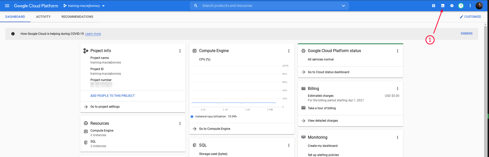
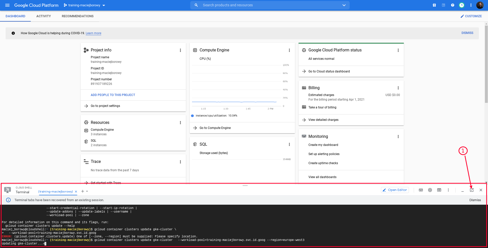
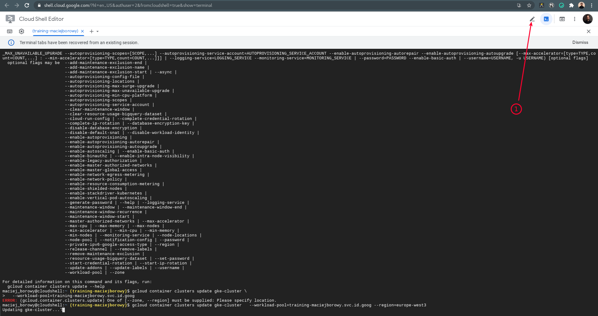
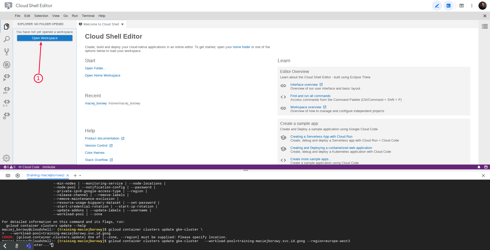
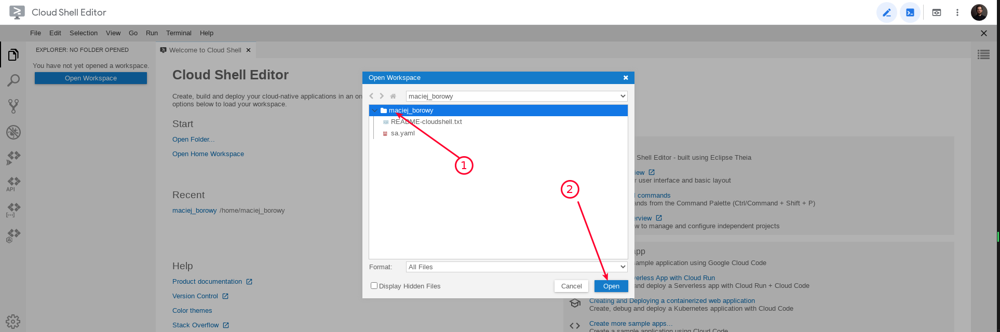

  
  
  

# Preparing lab environment

## LAB Overview

In this lab you'll prepare the common environment for all further labs.

---

## Prepare: Open Google Cloud Shell

1. Go to https://console.cloud.google.com/ and log into your account.
1. Open Cloud Shell in the new tab

   
   

1. Open the Cloud Shell Editor and click on the root directory to select your workspace.

   
   
   

## END LAB

 
 

&copy; 2021 Chmurowisko Sp. z o.o.

