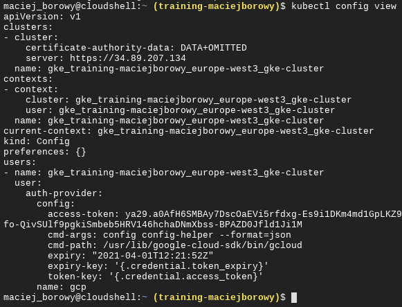
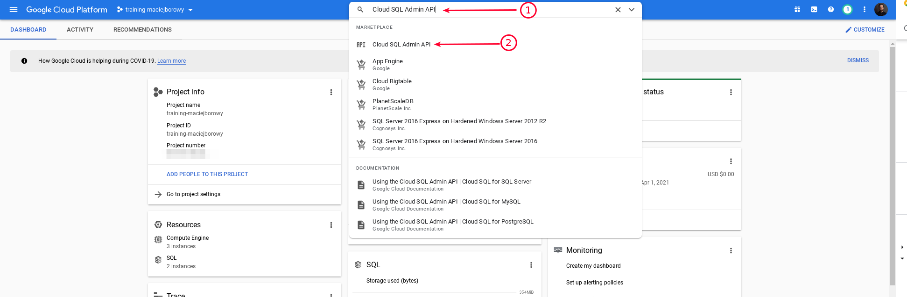
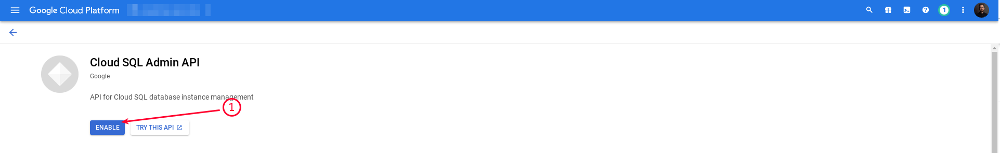
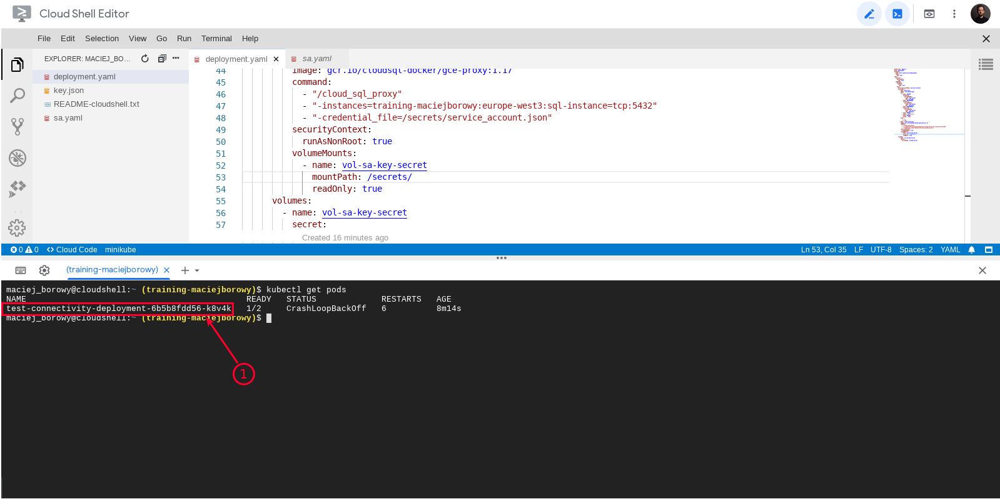

<br><br>
<br><br>
<br><br>

# Connecting to Cloud SQL using Service Account

## LAB Overview

In this lab you'll connect sample application hosted on GKE to Cloud SQL instance using Service Account.

---

## Step 1: Create GKE cluster

1. From the navigation menu go to "Kubernetes Engine". Enable the Kubernetes Engine service if it isn't already enabled.
1. Copy the following command, update the `[YOUR-PROJECT-ID]` and run it from Cloud Shell:

   ```bash
      export PROJECT_ID=`gcloud config get-value project` && \
   export M_TYPE=n1-standard-1 && \
   export REGION=europe-west3 && \
   export CLUSTER_NAME=${PROJECT_ID}-${RANDOM} && \
   export WORKLOAD=${PROJECT_ID}.svc.id.goog
   gcloud services enable container.googleapis.com && \
   gcloud container clusters create $CLUSTER_NAME \
   --cluster-version latest \
   --machine-type=$M_TYPE \
   --num-nodes 1 \
   --region $REGION \
   --project $PROJECT_ID \
   --workload-pool=$WORKLOAD
   ```

   This commend will create GKE cluster. It takes approx. 3 minutes to create a cluster.

   You can find _Project ID_ on the Dashboard page in GCP (in the navigation menu choose _Home_ > _Dashboard_)

1. Verify that cluster is up and running:

   ```bash
   kubectl config view
   ```

   Cloud Shell has `kubectl` already installed.

   In the result you should get similar output:

   

## Step 2: Enable the Cloud SQL Admin API

The API is needed to make connections from pod running the application to Cloud SQL.

1. In the search bar write: "Cloud SQL Admin API" and select the service:

   

1. Enable the API:

   

## Step 3: Create Kubernetes Secret object with database credentials

1. Copy and paste the following command to Cloud Shell:

   ```bash
   kubectl create secret generic sql-secret \
      --from-literal=username=postgres \
      --from-literal=password=password123 \
      --from-literal=database=wpe_test
   ```

## Step 4: Create Service Account

1. Go to the Service accounts page of the Google Cloud Console.
1. Click `+ Create Service Account`.
1. In the Create service account dialog, enter a descriptive name for the service account (e.g.: `sa-sql-instance`). Make sure that _Service Account ID_ is the same as name you wrote, otherwise copy it to the notepad.
1. Click Create.
1. Select the following roles, click Continue, and then click Done:

   - Cloud SQL > Cloud SQL Client
   - Cloud SQL > Cloud SQL Editor
   - Cloud SQL > Cloud SQL Admin

1. Click the action menu for your new service account and then select Manage keys.
1. Click the Add key drop-down menu and then click Create new key.
1. Confirm that the key type is JSON and then click Create. The private key file is downloaded to your machine, but it's not needed for now.

## Step 5: Create Kubernetes Service Account object

1. Go to the Cloud Shell Editor and create new file named: `sa.yaml` with contents of [this file (link)](./files/service-account.yaml).
1. Run the following command:

   ```bash
   kubectl apply -f service-account.yaml
   ```

## Step 6: Create the Service Account key and save it as Kubernetes Secret

1. In the Cloud Shell execute the following command:

   ```bash
   gcloud iam service-accounts keys create ~/key.json --iam-account <YOUR-SA-NAME>@<PROJECT-ID>.iam.gserviceaccount.com
   ```

   Replace `<YOUR-SA-NAME>` with Service Account name from previous step and `<PROJECT-ID>` with current Project ID.
   This command will create the `key.json` file in the current working directory.

1. Turn Service Account key into the Kubernetes Secret

   ```bash
   kubectl create secret generic sa-key-secret --from-file=service_account.json=./key.json
   ```

   `sa-key-secret` will be the Kubernetes Secret name.

## Step 7: Create deployment with application that connects to Cloud SQL

1. Open [this file (link)](./files/test-connectivity-deployment.yaml), create new file in Cloud Shell Editor named: `deployment.yaml` and paste there the file content.
1. Replace `<YOUR-INSTANCE-CONNECTION-NAME>` with correct _Instance Connection Name_ for your instance. To find Connection Name value run: `gcloud sql instances describe sql-instance`. _Instance Connection Name_ is stored under `connectionName`.
1. Apply the new deployment:

   ```bash
   hubectl apply -f deployment.yaml
   ```

1. Wait around 1 minute while GKE is provisioning a pod.
1. List all pods (should be only 1) and copy its name:

   ```bash
   kubectl get pods
   ```

   

1. Copy the `svc-test` Cluster IP address (`svc-test` is a Kubernetes Service exposing sample application internally to the cluster)

   ```bash
   kubectl get svc/svc-test
   ```

## Step 8: Make a request to the application

1. Create a container and connect to it:

   ```bash
   kubectl run -i --tty --image ubuntu dns-test --rm
   ```

1. Install `curl`

   ```bash
   apt update
   ```

   ```bash
   apt upgrade
   ```

   ```bash
   apt install curl
   ```

1. Call the `svc-test` service using copied IP address:

   ```bash
   curl <SVC-IP>:8080
   ```

   You should get the following output:

   ```json
   {
     "status": "ok",
     "data": [
       { "pid": 1, "firstname": "Joe", "lastname": "Doe" },
       { "pid": 2, "firstname": "Jane", "lastname": "Dee" }
     ]
   }
   ```

1. Exit the temporary container:

   ```bash
   exit
   ```

## END LAB

<br>
<br>
<center><p>&copy; 2021 Chmurowisko Sp. z o.o.<p></center>
