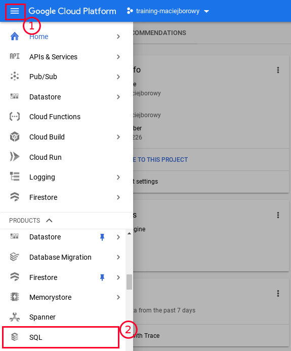
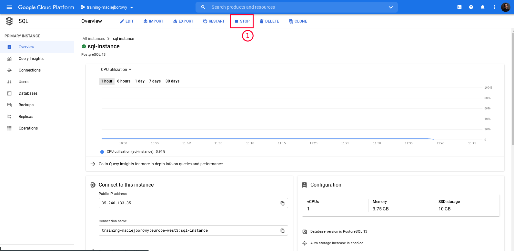
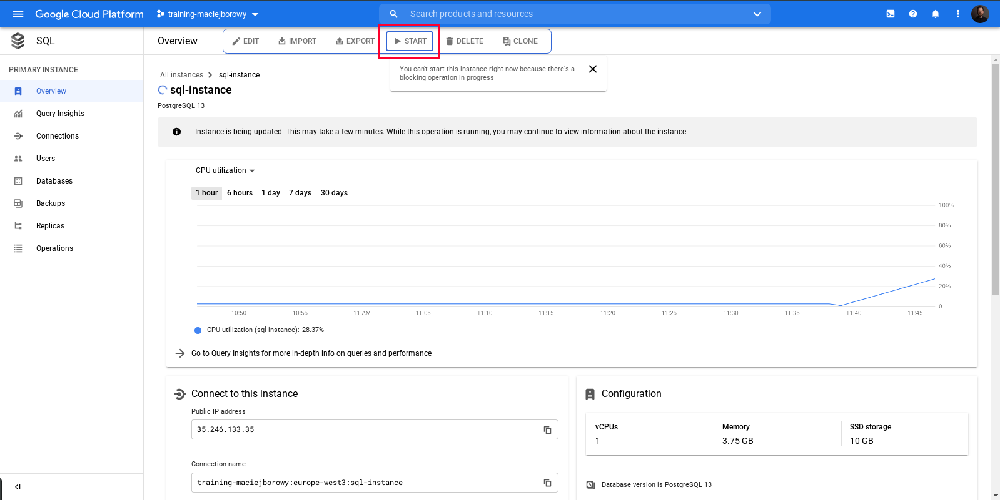
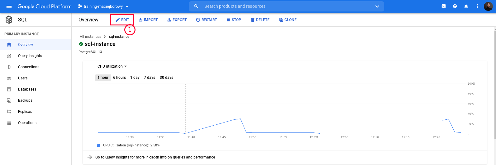
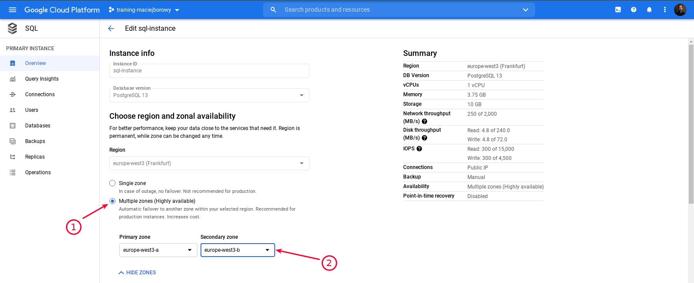
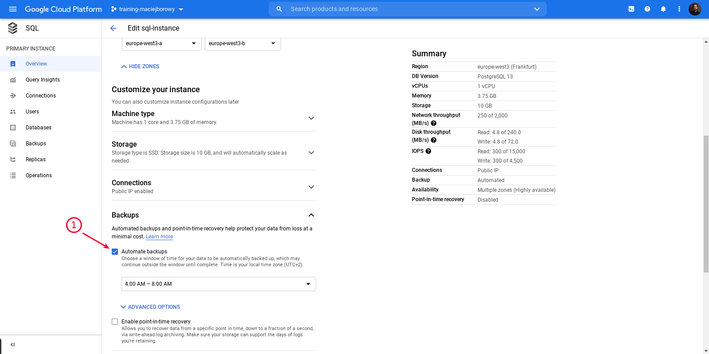
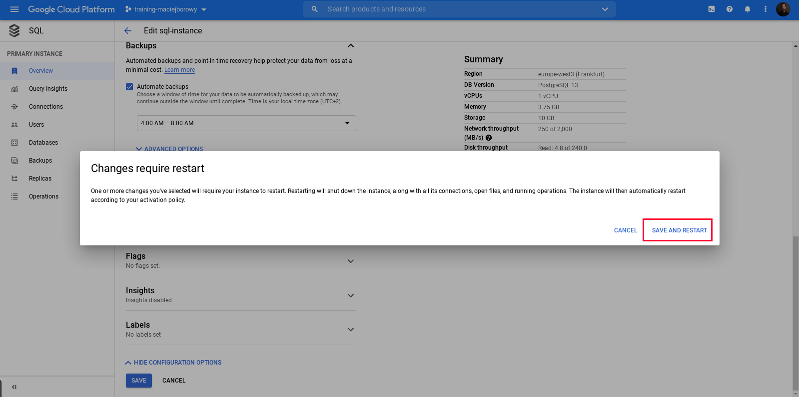
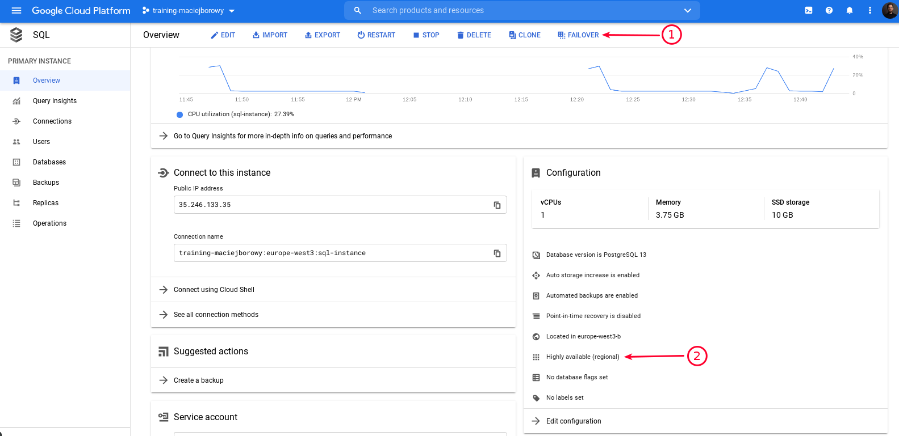
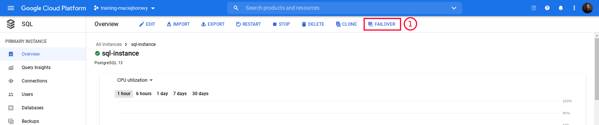

<br><br>
<br><br>
<br><br>

# Configuring Cloud SQL instance failover

## LAB Overview

In this lab you'll see how sample application behaves when it lose connection with Cloud SQL instance. Then you'll configure failover to switch to standby instance during database failure.

---

## Step 1: Open Cloud SQL instance overview page

1. In the navigation menu find _SQL_ and click on it. Find and select `sql-instance` on instances list.

   

## Step 2: Query sample application again

1. Copy the `svc-test` Cluster IP address.

   ```bash
   kubectl get svc/svc-test
   ```

1. Create a container and connect to it:

   ```bash
   kubectl run -i --tty --image ubuntu dns-test --rm
   ```

1. Install `curl`

   ```bash
   apt update
   ```

   ```bash
   apt upgrade
   ```

   ```bash
   apt install curl
   ```

1. Go to the Cloud Shell and run the following command:

   ```bash
   while true; do curl <SVC-IP>:8080/people && sleep 1 && echo ; done
   ```

   It will request your application every second and return data it get from database.

   You should get the following output:

   ```bash
   $ while true; do curl 10.83.245.205:8080/people && sleep 1 && echo ; done
   {"status":"ok","data":[{"pid":1,"firstname":"Joe","lastname":"Doe"},{"pid":2,"firstname":"Jane","lastname":"Dee"}]}
   {"status":"ok","data":[{"pid":1,"firstname":"Joe","lastname":"Doe"},{"pid":2,"firstname":"Jane","lastname":"Dee"}]}
   {"status":"ok","data":[{"pid":1,"firstname":"Joe","lastname":"Doe"},{"pid":2,"firstname":"Jane","lastname":"Dee"}]}
   {"status":"ok","data":[{"pid":1,"firstname":"Joe","lastname":"Doe"},{"pid":2,"firstname":"Jane","lastname":"Dee"}]}
   {"status":"ok","data":[{"pid":1,"firstname":"Joe","lastname":"Doe"},{"pid":2,"firstname":"Jane","lastname":"Dee"}]}
   {"status":"ok","data":[{"pid":1,"firstname":"Joe","lastname":"Doe"},{"pid":2,"firstname":"Jane","lastname":"Dee"}]}
   ...
   ```

   Don't stop the loop and move to the next step.

## Step 3: Stop the Cloud SQL instance

1. On the Cloud SQL instance overview page click on "Stop"

   

1. Go back to the `curl` loop and check the output. After you stopped database you should see following output:

   ```bash
   {"status":"fail","error":"Connection terminated unexpectedly"}
   {"status":"fail","error":"Connection terminated unexpectedly"}
   {"status":"fail","error":"Connection terminated unexpectedly"}
   {"status":"fail","error":"Connection terminated unexpectedly"}
   {"status":"fail","error":"read ECONNRESET"}
   {"status":"fail","error":"read ECONNRESET"}
   {"status":"fail","error":"read ECONNRESET"}
   {"status":"fail","error":"Connection terminated unexpectedly"}
   {"status":"fail","error":"Connection terminated unexpectedly"}
   {"status":"fail","error":"read ECONNRESET"}
   ...
   ```

   As long as database is stopped (faking the database error) you'll get above output.

   Don't stop the loop and move to the next step.

## Step 4: Restart the Cloud SQL instance

1. On the Cloud SQL instance overview page click on "Start"

   

1. Wait until application return correct database results.

## Step 5: Configure Failover

1. Go to instance configuration

   

1. Configure High Availablity (HA)

   

1. Configure Automated Backups (it is recommended by Google while enabling HA)

   

1. Save settings and restart instance

   

1. Verify if the failover is configured correctly

   
   

## Step 6: Initiate failover manually and observe application behavior

1. Go to the Cloud Shell and run the following command:

   ```bash
   while true; do curl <SVC-IP>:8080/people && sleep 1 && echo ; done
   ```

1. Click "Failover" button and trigger failover

   

1. Go back to the Cloud Shell and observe application.

   We expect to see similar output:

   ```bash
   $ while true; do curl 10.83.245.205:8080/people && sleep 1 && echo ; done
   {"status":"ok","data":[{"pid":1,"firstname":"Joe","lastname":"Doe"},{"pid":2,"firstname":"Jane","lastname":"Dee"}]}
   {"status":"ok","data":[{"pid":1,"firstname":"Joe","lastname":"Doe"},{"pid":2,"firstname":"Jane","lastname":"Dee"}]}
   {"status":"ok","data":[{"pid":1,"firstname":"Joe","lastname":"Doe"},{"pid":2,"firstname":"Jane","lastname":"Dee"}]}
   {"status":"ok","data":[{"pid":1,"firstname":"Joe","lastname":"Doe"},{"pid":2,"firstname":"Jane","lastname":"Dee"}]}
   {"status":"ok","data":[{"pid":1,"firstname":"Joe","lastname":"Doe"},{"pid":2,"firstname":"Jane","lastname":"Dee"}]}
   {"status":"ok","data":[{"pid":1,"firstname":"Joe","lastname":"Doe"},{"pid":2,"firstname":"Jane","lastname":"Dee"}]}
   {"status":"ok","data":[{"pid":1,"firstname":"Joe","lastname":"Doe"},{"pid":2,"firstname":"Jane","lastname":"Dee"}]}
   {"status":"ok","data":[{"pid":1,"firstname":"Joe","lastname":"Doe"},{"pid":2,"firstname":"Jane","lastname":"Dee"}]}
   {"status":"ok","data":[{"pid":1,"firstname":"Joe","lastname":"Doe"},{"pid":2,"firstname":"Jane","lastname":"Dee"}]}
   {"status":"ok","data":[{"pid":1,"firstname":"Joe","lastname":"Doe"},{"pid":2,"firstname":"Jane","lastname":"Dee"}]}
   {"status":"ok","data":[{"pid":1,"firstname":"Joe","lastname":"Doe"},{"pid":2,"firstname":"Jane","lastname":"Dee"}]}
   {"status":"fail","error":"read ECONNRESET"}
   {"status":"fail","error":"read ECONNRESET"}
   {"status":"fail","error":"read ECONNRESET"}
   {"status":"fail","error":"read ECONNRESET"}
   {"status":"fail","error":"read ECONNRESET"}
   {"status":"fail","error":"read ECONNRESET"}
   {"status":"fail","error":"read ECONNRESET"}
   {"status":"fail","error":"read ECONNRESET"}
   {"status":"fail","error":"read ECONNRESET"}
   {"status":"fail","error":"read ECONNRESET"}
   {"status":"fail","error":"read ECONNRESET"}
   {"status":"fail","error":"read ECONNRESET"}
   {"status":"fail","error":"read ECONNRESET"}
   {"status":"fail","error":"read ECONNRESET"}
   {"status":"fail","error":"timeout expired"}
   {"status":"fail","error":"timeout expired"}
   {"status":"fail","error":"Connection terminated unexpectedly"}
   {"status":"fail","error":"Connection terminated unexpectedly"}
   {"status":"fail","error":"Connection terminated unexpectedly"}
   {"status":"fail","error":"Connection terminated unexpectedly"}
   {"status":"ok","data":[{"pid":1,"firstname":"Joe","lastname":"Doe"},{"pid":2,"firstname":"Jane","lastname":"Dee"}]}
   {"status":"ok","data":[{"pid":1,"firstname":"Joe","lastname":"Doe"},{"pid":2,"firstname":"Jane","lastname":"Dee"}]}
   {"status":"ok","data":[{"pid":1,"firstname":"Joe","lastname":"Doe"},{"pid":2,"firstname":"Jane","lastname":"Dee"}]}
   {"status":"ok","data":[{"pid":1,"firstname":"Joe","lastname":"Doe"},{"pid":2,"firstname":"Jane","lastname":"Dee"}]}
   {"status":"ok","data":[{"pid":1,"firstname":"Joe","lastname":"Doe"},{"pid":2,"firstname":"Jane","lastname":"Dee"}]}
   ```

   As you see my application switched to standby instance after ~20 seconds.

1. Stop `curl` loop using `Ctrl-C` combination and exit temporary container.

---

## END LAB

<br>
<br>
<center><p>&copy; 2021 Chmurowisko Sp. z o.o.<p></center>
