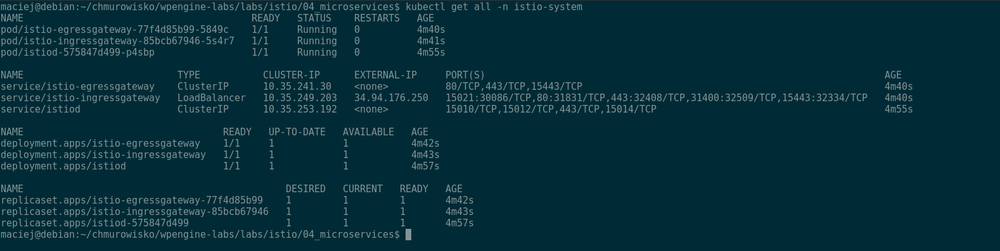

<br><br>
<br><br>
<br><br>

# Installing Istio

## LAB Overview

In this lab you'll install Istio on a cluster.

## Prerequisite

You will need the following tools:

- `kubectl` installed locally on your machine (https://kubernetes.io/docs/tasks/tools/#kubectl)
- `istioctl` installed locally on your machine (https://istio.io/latest/docs/ops/diagnostic-tools/istioctl/#install-hahahugoshortcode-s2-hbhb)
- `gcloud` installed locally

1. Make sure you have installed all the necessary tools:

   ```bash
   $ kubectl version
   Client Version: version.Info{Major:"1", Minor:"20", GitVersion:"v1.20.3", GitCommit:"01849e73f3c86211f05533c2e807736e776fcf29", GitTreeState:"clean", BuildDate:"2021-02-17T12:44:29Z", GoVersion:"go1.15.8", Compiler:"gc", Platform:"linux/amd64"}
   Server Version: version.Info{Major:"1", Minor:"18+", GitVersion:"v1.18.16-gke.302", GitCommit:"2e4de00ee51e92a708578409838fd37044b00902", GitTreeState:"clean", BuildDate:"2021-03-08T22:06:14Z", GoVersion:"go1.13.15b4", Compiler:"gc", Platform:"linux/amd64"}
   ```

   ```bash
   $ istioctl version
   client version: 1.9.2
   control plane version: 1.6.14-gke.0-8c74bce5a2449be969f3f5ae4a0876cb4af50dbf
   data plane version: 1.6.14-gke.0 (1 proxies)
   ```

   ```bash
   $ gcloud version
   Google Cloud SDK 319.0.0
   alpha 2020.11.13
   beta 2020.11.13
   bq 2.0.62
   cloud-datastore-emulator 2.1.0
   core 2020.11.13
   gsutil 4.55
   kubectl 1.16.13
   ```

---

## Task 1: Create Kubernetes cluster & log into your cluster from local machine

1. In case you have no clusters listed execute the following command:

   ```bash
   export PROJECT_ID=`gcloud config get-value project` && \
   export M_TYPE=n1-standard-1 && \
   export REGION=europe-west3 && \
   export CLUSTER_NAME=${PROJECT_ID}-${RANDOM} && \
   gcloud services enable container.googleapis.com && \
   gcloud container clusters create $CLUSTER_NAME \
   --cluster-version latest \
   --machine-type=$M_TYPE \
   --num-nodes 1 \
   --region $REGION \
   --project $PROJECT_ID
   ```

   This command will create a new cluster.

1. Save credentials in `kubectl` and log into the cluster:

   ```bash
   gcloud container clusters get-credentials $CLUSTER_NAME \
    --region $REGION \
    --project $PROJECT_ID
   ```

1. Get cluster name:

   ```bash
   gcloud container clusters list
   ```

   Make sure that cluster region is `europe-west3`. Note the `MASTER_IP` value.

1. Verify that you logged into correct cluster by comparing `MASTER_IP` of a cluster with listed URLs.

   My `MASTER_IP` is `35.198.150.17` and it matches IP in URLs.

   ```bash
   $ kubectl cluster-info
   Kubernetes control plane is running at https://35.198.150.17
   GLBCDefaultBackend is running at https://35.198.150.17/api/v1/namespaces/kube-system/services/default-http-backend:http/proxy
   KubeDNS is running at https://35.198.150.17/api/v1/namespaces/kube-system/services/kube-dns:dns/proxy
   Metrics-server is running at https://35.198.150.17/api/v1/namespaces/kube-system/services/https:metrics-server:/proxy
   ```

## Task 2: Install Istio

1. Verify that no pod are running in `istio-system` namespace:

   ```bash
   istioctl version
   ```

   The expected output is:

   ```bash
   no running Istio pods in "istio-system"
   1.9.2
   ```

1. Run the following command to install Istio on a cluster:

   ```bash
   istioctl install --set profile=demo -y
   ```

1. Execute following command:

   ```bash
   kubectl get all -n istio-system
   ```

   As a result you should get a snippet similiar to:

   

   If the _istio-ingressgateway_ shows an external IP of `<pending>`, wait a few minutes until an IP address has been assigned by Google networking.

   1. Execute following command:

   ```bash
   kubectl get pods -n istio-system
   ```

   As a result all of the pods should show a status of _Running_.

## Task 3: Install necessary addons

1. Run the following command to install necessary addons:

   ```bash
   kubectl apply -f files
   ```

   Run this command again if you encounter problem with installing Kiali and `MonitoringDashboard`.

1. Verify that all pods in namespace `istio-system` are running:

   ```bash
   kubectl get pods -n istio-system
   ```

1. Log into the Kiali dashboard running on the `localhost:20001`:

   ```bash
   istioctl dashboard kiali
   ```

## END LAB

<br><br>

<center><p>&copy; 2021 Chmurowisko Sp. z o.o.<p></center>
