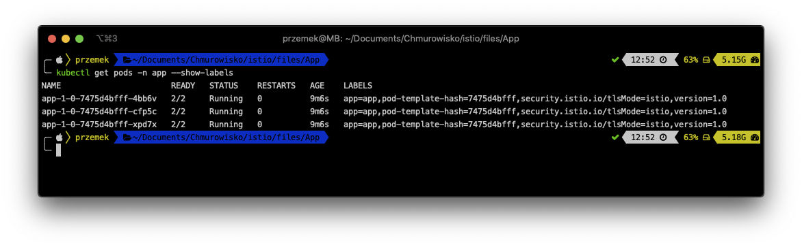
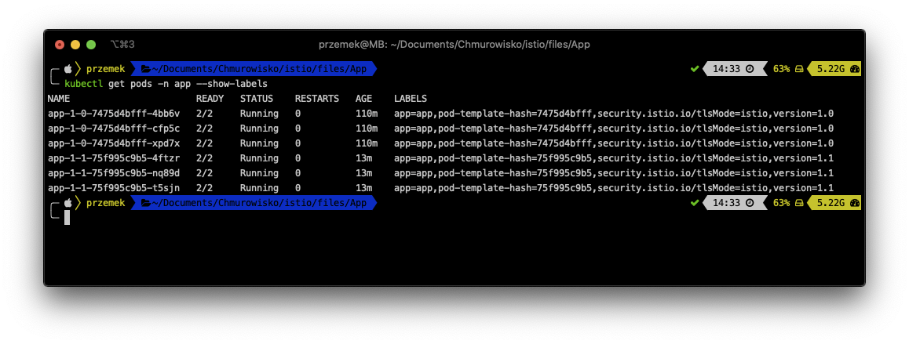

<br><br>
<br><br>
<br><br>

# Deploying an application using Istio

## LAB Overview

In this lab you will deploy an app using canary deployment. Then you'll configure application for A/B testing based on a cookie in request header.

## Task 1: Create namespace for the application

1. Open a terminal of your choice.
1. Create new namespace:

   ```bash
   kubectl create namespace app
   ```

1. Label the namespace with _istio-injection=enabled_. This label instructs Istio to automatically inject the istio-proxies as sidecars into all of your pods in this namespace.

   ```bash
   kubectl label namespace app istio-injection=enabled
   ```

## Task 2: Deploy the application

1. Download [deployment manifest file](files/1_deployment.yaml) and execute:

   ```bash
   kubectl apply -f 1_deployment.yaml -n app
   ```

   Now you should have the first version of the app deployed to the AKS cluster. 2. Examine the pods by executing:

   ```bash
   kubectl get pods -n app --show-labels
   ```

   

## Task 3: Create Virtual Service and a Gateway

1. Download [manifest file](files/2_gateway.yaml) and execute following command:

   ```bash
   kubectl apply -f 2_gateway.yaml -n app
   ```

   Now you should have both virtual service and gateway created. 2. Obtain the external IP of your ingress

   ```bash
   kubectl get svc -n istio-system
   ```

   and look for External IP address of _istio-ingressgateway_ service

1. Open any browser of your choice and try connecting to that IP address. You should get following web page:

   

## Task 4: Deploy a new version of the application

1. Download [manifest file](files/3_deployment_update.yaml) and execute following command:

   ```bash
   kubectl apply -f 3_deployment_update.yaml -n app
   ```

1. Get the list of running pods:

   ```bash
   kubectl get pods -n app --show-labels
   ```

   As you can see, now you have both old and new version deployed:

   

1. Replace `<EXTERNAL_IP>` and run the following command:

   ```bash
   for IDX in {1..10}; do curl <EXTERNAL_IP> && sleep 0.5 && echo ; done
   ```

   Istio should split requests to both versions almost equally.

## Task 5: Configure Canary testing

1. Download [manifest file](files/4_ver2_20.yaml).
1. Examine the file. You will create a destination rule and update existing virtual service for the app.
   Now we want to send 20% of the traffic to version 2 and 80% of the traffic to version 1.
1. Execute following command:

   ```bash
   kubectl apply -f 4_ver2_20.yaml -n app
   ```

1. Replace `<EXTERNAL_IP>` and run the following command:

   ```bash
   for IDX in {1..20}; do curl <EXTERNAL_IP> && sleep 0.5 && echo ; done
   ```

   Istio should route requests most request to version 1 and only a few to version 2.

1. Quit the loop using Ctrl-C shortcut.

## Task 6: Send all requests to version 2

1. Download [manifest file](files/5_ver2_all.yaml).
1. Execute following command:

   ```bash
   kubectl apply -f 5_ver2_all.yaml -n app
   ```

1. Replace `<EXTERNAL_IP>` and run the following command:

   ```bash
   for IDX in {1..10}; do curl <EXTERNAL_IP> && sleep 0.5 && echo ; done
   ```

   Now all requests should be routed to version 2.

## Task 7: Configure Istio to route requests based on cookie

In this step you'll configure Istio to route traffic based on cookie coming in request. When cookie `version=test` comes with request traffic is routed to pods running version 2.0. Otherwise, all traffic is routed to pods running version 1.0.

1. Execute the following command:

   ```bash
   kubectl apply -f 6_ab_test.yaml
   ```

## Task 8: Perform A/B testing based on cookie

1. Verify that Istio correctly manage traffic. Send 10 requests without a cookie:

   ```bash
   for IDX in {1..10}; do curl <EXTERNAL_IP> && sleep 0.5 && echo ; done
   ```

   You should output like this:

   ```bash
   $ for IDX in {1..10}; do curl 35.242.254.28 && sleep 0.5 && echo ; done
   Hey. Welcome!!! It's version 1
   Hey. Welcome!!! It's version 1
   Hey. Welcome!!! It's version 1
   Hey. Welcome!!! It's version 1
   Hey. Welcome!!! It's version 1
   Hey. Welcome!!! It's version 1
   Hey. Welcome!!! It's version 1
   Hey. Welcome!!! It's version 1
   Hey. Welcome!!! It's version 1
   Hey. Welcome!!! It's version 1
   ```

1. Now, send 10 requests with cookie `version=test`:

   ```bash
   for IDX in {1..10}; do curl --cookie version=test <EXTERNAL_IP> && sleep 0.5 && echo ; done
   ```

   You should output like this:

   ```bash
   $ for IDX in {1..10}; do curl --cookie version=test 35.242.254.28 && sleep 0.5 && echo ; done
   Hey. Welcome!!! It's version 2
   Hey. Welcome!!! It's version 2
   Hey. Welcome!!! It's version 2
   Hey. Welcome!!! It's version 2
   Hey. Welcome!!! It's version 2
   Hey. Welcome!!! It's version 2
   Hey. Welcome!!! It's version 2
   Hey. Welcome!!! It's version 2
   Hey. Welcome!!! It's version 2
   Hey. Welcome!!! It's version 2
   ```

## END LAB

<br><br>

<center><p>&copy; 2021 Chmurowisko Sp. z o.o.<p></center>
