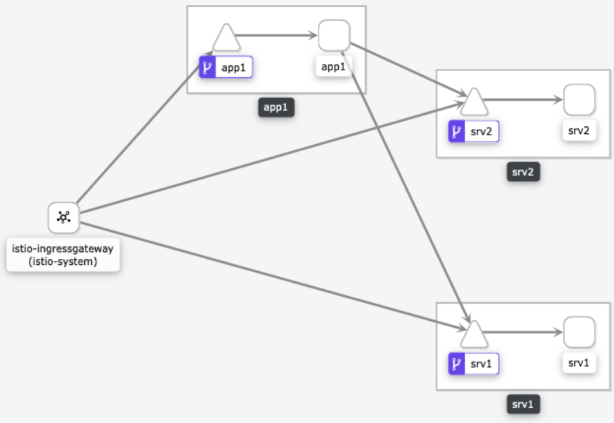
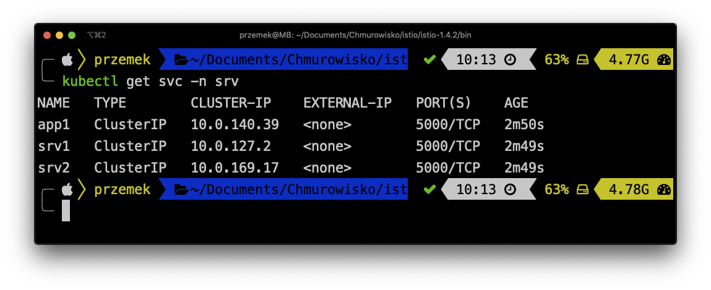
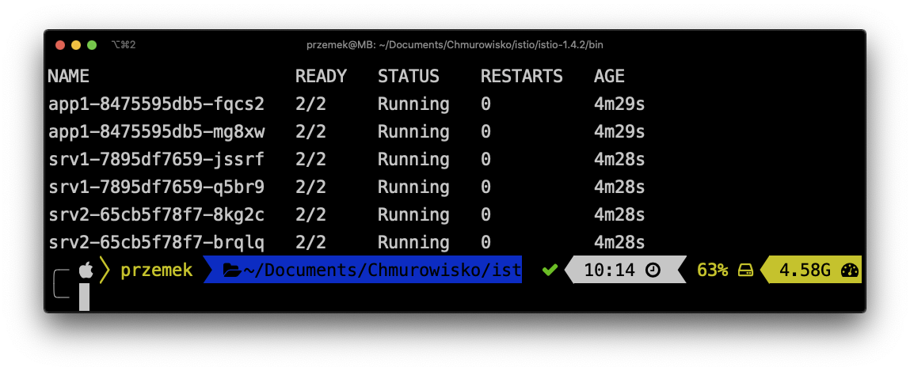
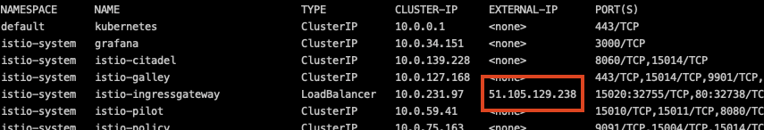

<br><br>
<br><br>
<br><br>

# Deploying microservices

## LAB Overview

In this lab you will perform a deployment of microservices application to the cluster



## Task 1: Creating a namespace for the deployment

1. Execute following command to create a namespace for the deployment

   ```bash
   kubectl create namespace srv
   ```

1. The default Istio installation uses automatic sidecar injection. Label the namespace that will host the application with `istio-injection=enabled`:

   ```bash
   kubectl label namespace srv istio-injection=enabled
   ```

## Task 2: Deploying the appliacaion

1. Download [a manifest file](files/k8s/deployments.yaml).
1. Deploy the file by executing:

   ```bash
   kubectl apply -f deployments.yaml -n srv
   ```

   Using the deployments file you created:

   - 3 service accounts
   - 3 deployments
   - 1 virtual services
   - ingress

## Task 3: Verifying the solution

1. Verify that all services are up and running by executing the following command:

   ```bash
   kubectl get svc -n srv
   ```

   You should have 3 service running:

   

1. Verify that the Istio proxy was injected to all the pods:

   ```bash
   kubectl get pods -n srv
   ```

   

1. Determine the ingress IP by executing the following command:

   ```bash
   kubectl get svc --all-namespaces
   ```

   Find the external IP for your ingress:

   

1. Open any browser of your choice and open following URLs:

   - `<YOUR-INGRESS-IP>/app1`
   - `<YOUR-INGRESS-IP>/srv1`
   - `<YOUR-INGRESS-IP>/srv2`

   All pages should be accessible.

1. Using `bash` execute following command

   ```bash
   for ((i=1;i<=100;i++)); do curl "<YOUR-INGRESS-IP>/app1"; done
   ```

1. Open Kiali dashboard by executing:

   ```bash
   istioctl dashboard kiali
   ```

1. Open **Graph** menu and turn on **Traffic animation**.

1. Execute the following command once again and watch the animation:

   ```bash
   for ((i=1;i<=100;i++)); do curl "<YOUR-INGRESS-IP>/app1"; done
   ```
   
1. Open Jaeger dashboard by executing:

   ```bash
   istioctl dashboard jaeger
   ```
1. Explore traces displayed in Jaeger

## END LAB

<br><br>

<center><p>&copy; 2021 Chmurowisko Sp. z o.o.<p></center>
